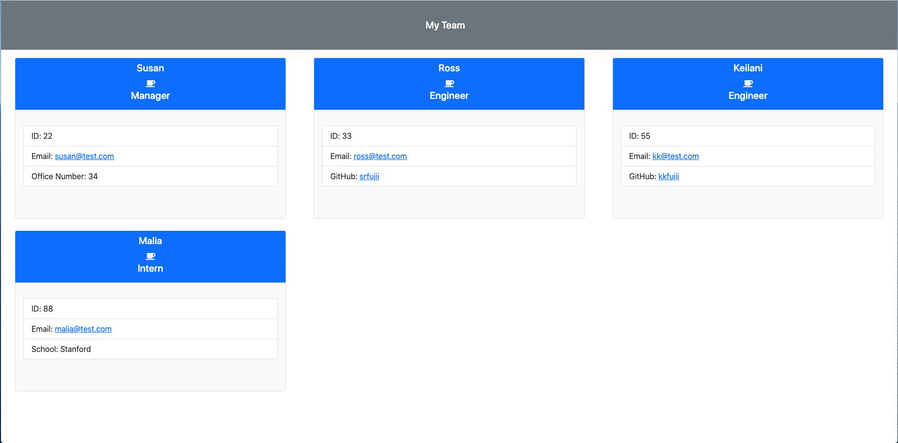
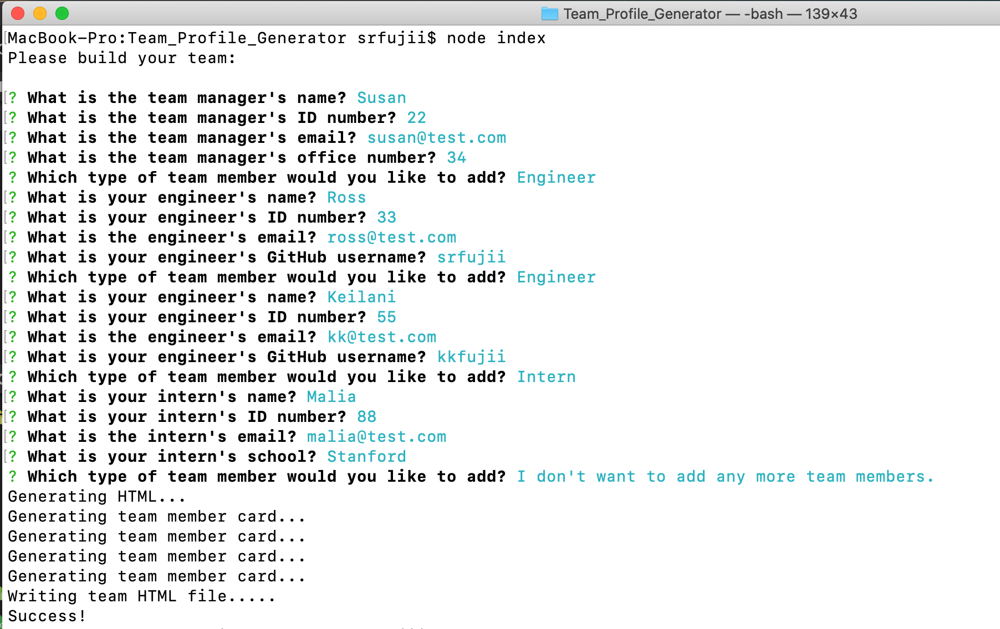
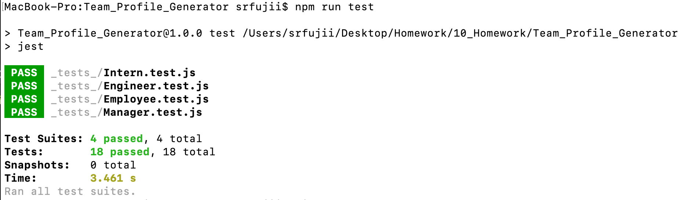

# Team Profile Generator
  [](https://opensource.org/licenses/MIT)

  ## Description

  This team profile generator automatically generates a visual "My Team" HTML file for your team based on short, quick, and simple user prompts. Using a command-line interface, you will be asked a series of quick and easy questions about the team members you wish to include. This app then saves your answers and automatically generates a professional, visual "My Team" file for your project including information about your team members, including whether they are engineers or interns and appropriate information for each.

  ## Table of Contents

  * [Installation](#installation)
  * [Usage](#usage)
  * [Video](#video)
  * [Screenshots](#screenshots)
  * [License](#license)
  * [Contribute](#contribute)
  * [Tests](#tests)
  * [Questions](#questions)
 
  ## Installation

  To install necessary dependencies, run the following command:

  ```
  npm i
  ```

  ## Usage

  This is a student repo.

  ## Video

  Please click on the following link to see a walkthrough video of this application's functionality:

  [Screentastify Video](https://drive.google.com/file/d/1GxQGU23Genje0yPLMYOFLyYvB9F82T9u/view)

  ## Screenshots

  
  
  

  ## License

  [](https://opensource.org/licenses/MIT) This project is licensed under the [MIT](https://opensource.org/licenses/MIT) license.

  ## Contribute

  Contributions are always welcome! (Please fork and pull request only.)

  ## Tests

  To run tests, run the following command: 

  ```
  npm test
  ```

  ## Questions

  If you have any questions about the repo, open an issue or contact me directly at susan.fujii@me.com. You can find more of my work at [srfujii](https://github.com/srfujii/).

